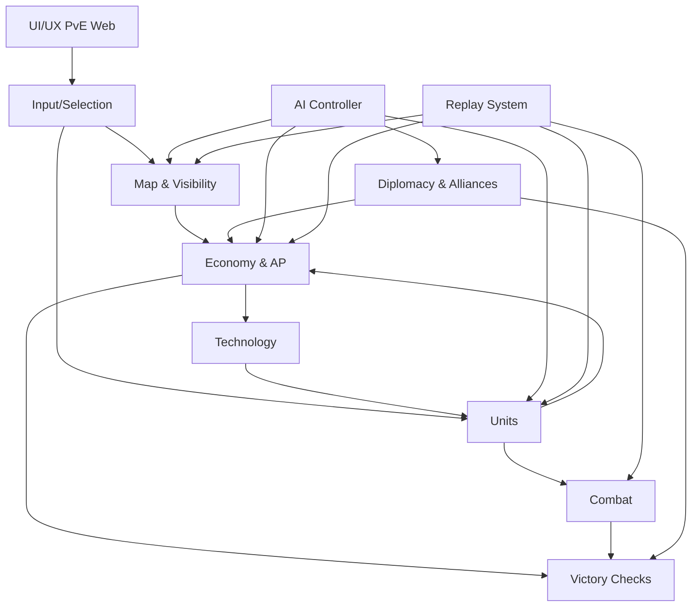

# Red Age — Production Spec (v3.0)

Этот репозиторий содержит спецификацию игры **Red Age** в формате Markdown, разбитую на логические части для совместной работы в **Claude** и **Cursor**.

## Статус
- Версия спецификации: **v3.0 (Phase 1)**
- Режим разработки: **PvE (Web) first**
- Стиль UI/UX: **минимализм (Polytopia-like)**, светлая тема, реалистичная, но упрощённая карта.

## Как работать (рекомендуемый workflow Claude/Cursor)
1. Открывайте нужный раздел в `docs/**` и вносите правки в рамках одной темы.
2. Любые изменения механик фиксируйте:
   - в соответствующем разделе (например, экономика → `docs/04_economy/*`)
   - и в `docs/00_meta/CHANGELOG.md` (коротко: что/почему)
3. Для прототипа используйте:
   - сущности/структуры из `schemas/` (можно расширять)
4. Старайтесь не дублировать правила: если правило относится к двум системам — храните его в «источнике истины» и делайте ссылку.

## Структура
- `docs/01_overview` — концепция, цели, режимы
- `docs/02_cities` — захват, интеграция, уровни городов
- `docs/03_map` — генерация карты, типы клеток, города, видимость
- `docs/04_economy` — ресурсы, ОД, добыча, стабильность, магистраль
- `docs/05_tech` — ветки технологий, правила победы по технологиям
- `docs/06_combat` — формулы боя, окружение, горы, осада, авиа/флот
- `docs/07_units` — базовые + уникальные юниты, кибер, гиперзвук, дроны
- `docs/08_diplomacy` — союзы, ограничения, победа альянса
- `docs/09_ai` — модель ИИ (LeaderIndex, WarScore и т.д.), уровни сложности
- `docs/10_uiux` — PvE Web UI/UX спецификация
- `docs/11_replays` — реплеи/наблюдение
- `docs/12_monetization` — монетизация (PvE/PvP разграничение)
- `schemas/` — JSON-черновики сущностей (для Cursor/Claude)

## Карта зависимостей систем (Mermaid)

## Быстрые ссылки
- Обзор: `docs/01_overview/README.md`
- Полные правила: `docs/00_meta/SOURCE_OF_TRUTH.md`
